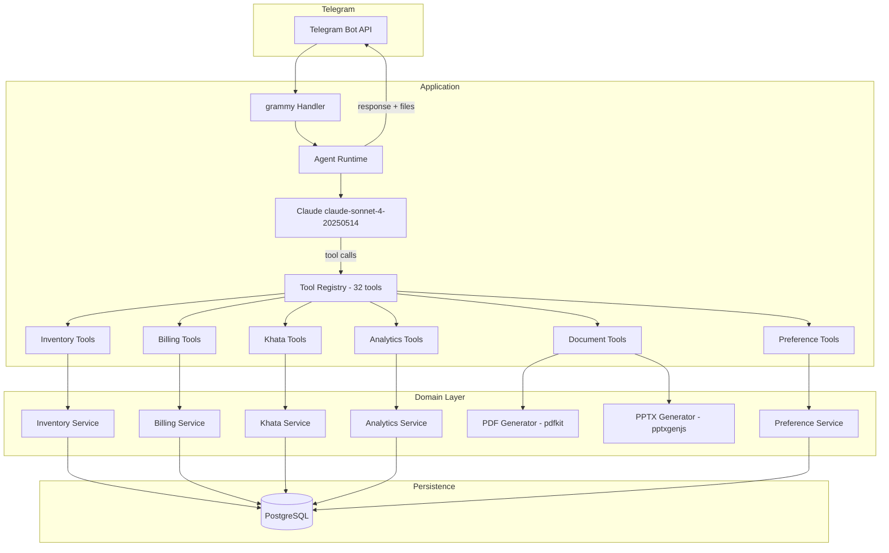

# Supermarket Ops Agent

An AI-operated Indian kirana/supermarket controlled entirely through Telegram. **The chat is the product.** No web dashboard, no admin panel — just natural language via Telegram.

## Architecture



## Agent Harness: Direct Anthropic SDK with Agentic Loop

**Why not Claude Agent SDK / LangGraph / Vercel AI SDK?**

I chose to implement the agentic loop directly with the Anthropic SDK because:

1. **Full control over the tool-calling loop** — the loop is ~50 lines, easy to reason about
2. **No framework lock-in** — no abstractions hiding what's happening
3. **Native Claude tool-calling** — Claude's tool_use API is already designed for this pattern
4. **Transparent debugging** — every tool call and result is logged

### Control Loop

```
User message → Claude
    ↓
Claude reasons → selects tool(s) → returns tool_use blocks
    ↓
Execute tools → get structured results
    ↓
Feed results back to Claude
    ↓
Claude reasons again → may call more tools or produce final response
    ↓
(repeat up to 15 rounds)
    ↓
Send text + files to Telegram
```

A single user message like *"make a bill: 2kg sugar, 4 Maggi, UPI"* triggers Claude to chain: `search_products` → `search_products` → `create_bill` → `add_bill_item` → `add_bill_item` → `set_payment_method` → respond with bill summary.

## Tool/Skill Design

32 tools across 6 domains — each does one thing, validates inputs, and returns structured results:

| Domain | Tools |
|--------|-------|
| **Inventory** | `search_products`, `get_product`, `add_product`, `receive_stock`, `get_stock`, `get_low_stock`, `get_inventory_history` |
| **Billing** | `create_bill`, `get_current_bill`, `add_bill_item`, `update_bill_item`, `remove_bill_item`, `remove_bill_item_by_name`, `set_payment_method`, `finalize_bill`, `cancel_bill`, `get_bill` |
| **Khata** | `add_khata_credit`, `record_khata_payment`, `get_khata_balance`, `get_khata_history`, `get_all_outstanding_balances` |
| **Analytics** | `get_daily_sales`, `close_day`, `get_sales_range` |
| **Documents** | `generate_invoice_pdf`, `generate_analysis_deck` |
| **Preferences** | `get_owner_preferences`, `set_owner_preference`, `reset_owner_preference` |

## Database Design

PostgreSQL with Prisma ORM. All monetary values stored as **integers in paise** (₹1 = 100 paise) to avoid floating-point arithmetic bugs.

Key tables: `Product`, `Bill`, `BillItem`, `Customer`, `KhataEntry`, `OwnerPreference`, `InventoryHistory`, `DailySummary`, `ConversationState`, `ProcessedUpdate`, `BillSequence`.

## Hard Parts — How They're Solved

### Grounding
All business data (products, prices, stock, GST) comes from PostgreSQL via tools. Claude never invents data.

### Oversell Guard
Stock decrement uses an atomic conditional SQL update:
```sql
UPDATE "Product" SET quantity = quantity - $1 WHERE id = $2 AND quantity >= $1
```
Returns 0 rows if insufficient → tool returns structured error → Claude explains to user.

### GST Correctness
- Per-product GST rate and HSN code stored in DB
- Deterministic calculation in `money.ts` using `Decimal.js`
- CGST = rate/2, SGST = rate/2 (intra-state)
- Supported slabs: 0%, 5%, 12%, 18%
- Invoice shows full tax breakup

### Multi-Turn Bills
Bills have lifecycle: `DRAFT` → `FINALIZED` / `CANCELLED`. Stock is decremented **only** during finalization. Items can be added/removed/updated while in DRAFT.

### Idempotency
- `finalize_bill` checks bill status first — re-finalizing a FINALIZED bill returns existing result
- Telegram update IDs tracked in `ProcessedUpdate` table to skip redelivered messages

### Concurrency
- Serializable isolation level for bill finalization
- Row-level locking (`SELECT ... FOR UPDATE`) on products and customers
- Atomic conditional updates for stock decrement

### Memory Across Sessions
`OwnerPreference` table stores key-value pairs scoped by Telegram user. `/new` clears conversation history (in-memory) but preserves all preferences, inventory, bills, and customer data in PostgreSQL.

### Real Artifacts
- **PDF**: Generated with `pdfkit` — proper PDF with shop info, line items, GST breakup, totals
- **PPTX**: Generated with `pptxgenjs` — real charts (bar, pie), GST summary table, stock health

## Local Setup

```bash
# 1. Clone and install
git clone <repo-url>
cd supermarket-ops-agent
npm install

# 2. Configure environment
cp .env.example .env
# Edit .env with your TELEGRAM_BOT_TOKEN and ANTHROPIC_API_KEY

# 3. Start PostgreSQL
docker compose up -d

# 4. Setup database
npx prisma db push
npm run db:seed

# 5. Start the bot
npm run dev

# 6. Run tests
npm test
```

## Environment Variables

| Variable | Required | Description |
|----------|----------|-------------|
| `TELEGRAM_BOT_TOKEN` | ✅ | From @BotFather |
| `ANTHROPIC_API_KEY` | ✅ | Anthropic API key |
| `DATABASE_URL` | ✅ | PostgreSQL connection string |
| `CLAUDE_MODEL` | ❌ | Model name (default: `claude-sonnet-4-20250514`) |
| `LOG_LEVEL` | ❌ | Logging level (default: `info`) |

## Example Interactions

```
User: 50 packets of Maggi came in, cost ₹12, MRP ₹14
Agent: ✅ Received 50 packets of Maggi 70g. New stock: 150 packets.

User: make a bill: 2kg sugar, 4 Maggi, 1 butter, UPI
Agent: Created bill with:
  • Sugar - Loose: 2 kg × ₹48.00 = ₹96.00
  • Maggi 70g: 4 × ₹14.00 = ₹56.00 + ₹6.72 GST
  • Amul Butter 100g: 1 × ₹62.00 = ₹62.00 + ₹7.44 GST
  Total: ₹228.16 | Payment: UPI
  Shall I finalize?

User: drop the butter, make it 6 Maggi
Agent: Updated bill:
  • Sugar: 2 kg × ₹48.00 = ₹96.00
  • Maggi: 6 × ₹14.00 = ₹84.00 + ₹10.08 GST
  Total: ₹190.08

User: finalize
Agent: ✅ Bill INV-000001 finalized. Total: ₹190.08 (UPI)

User: put ₹500 on Ramesh's credit
Agent: ₹500 credit added to Ramesh's khata. Balance: ₹500.00

User: Ramesh paid ₹300
Agent: Payment recorded. Remaining balance: ₹200.00

User: always assume UPI unless I say cash
Agent: Preference saved: default payment = UPI. This persists across chats.

User: /new
Agent: Fresh conversation. Your preferences and store data are preserved.
```

## Deployment

The application is designed for deployment on any Node.js hosting platform (Railway, Render, Fly.io, VPS):

1. Set environment variables
2. Ensure PostgreSQL is accessible
3. Run `npx prisma db push` for migrations
4. Run `npm run db:seed` for initial data
5. Start with `npm start` or `npm run dev`

## Known Limitations

- **Single-store**: Currently designed for one store per bot instance
- **No real payment gateway**: Payment modes are recorded but not processed
- **No image/barcode support**: Product identification is text-based
- **No voice message support**: Text only
- **In-memory conversation**: Conversation history is lost on process restart (preferences and business data are not)
- **No scheduled reports**: Analysis deck is generated on-demand only

## What Would Be Improved With More Time

- Multi-store/multi-user support with role-based access
- Voice message transcription → bill creation
- Barcode scanning via photo
- Scheduled weekly reports auto-sent
- Hindi/Tamil language support
- Expiry/batch tracking (FEFO)
- Branded invoice templates
- Conversation history persistence (Redis/DB)
- Rate limiting per user
- Webhooks instead of polling for production Telegram
